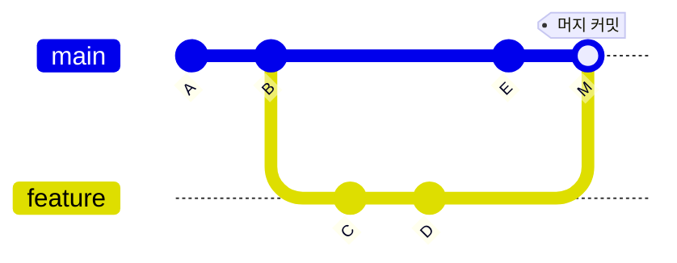
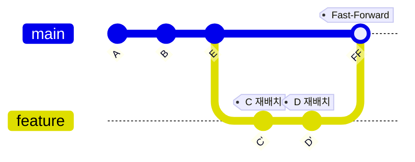
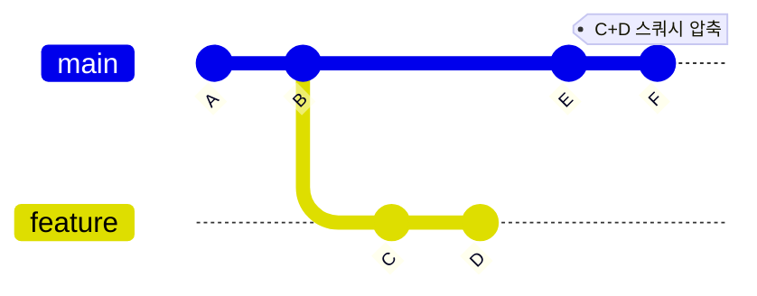

# Git & GitHub 완벽 가이드

> 개발자와 관리자를 위한 실전 완벽 가이드
> **Team Plan Edition v2.1**

---

## 목차

### Part 1: Git 기초
1. [Git vs SVN 핵심 비교](#1-git-vs-svn-핵심-비교)
2. [🔑 설치 가이드](#2-설치-가이드)
3. [🔑 최초 설정 & 초기화](#3-최초-설정--초기화)
4. [🔑 Git의 3가지 상태 이해하기](#4-git의-3가지-상태-이해하기)
5. [🔑 기본 흐름: 저장하기](#5-기본-흐름-저장하기)
6. [🔑 브랜치 다루기](#6-브랜치-다루기)
7. [브랜치 생명주기](#7-브랜치-생명주기)
8. [🔑 되돌리기: Stash, Reset, Revert](#8-되돌리기-stash-reset-revert)

### Part 2: Git 심화
9. [🔑 머지 전략](#9-머지-전략)
10. [🔑 충돌 해결하기](#10-충돌-해결하기)
11. [히스토리 탐색: git log 활용](#11-히스토리-탐색-git-log-활용)

### Part 3: GitHub 시작하기
12. [🔑 기존 프로젝트 참여하기: Clone & Fork](#12-기존-프로젝트-참여하기-clone--fork)
13. [원격 저장소 연결하기](#13-원격-저장소-연결하기)
14. [🔑 동기화의 핵심: fetch vs pull](#14-동기화의-핵심-fetch-vs-pull)
15. [🔑 GitHub Flow 완벽 해부](#15-github-flow-완벽-해부)

### Part 4: GitHub 협업
16. [GitHub 웹 사용법](#16-github-웹-사용법)
17. [GitHub CLI (gh) 활용](#17-github-cli-gh-활용)
18. [🔑 Pull Request 심화 가이드](#18-pull-request-심화-가이드)
19. [Issue & Project 관리](#19-issue--project-관리)
20. [Best Practices](#20-best-practices)

### Part 5: DevOps & 자동화
21. [GitHub Actions (CI/CD)](#21-github-actions-cicd)
22. [GitHub Actions 심화](#22-github-actions-심화)
23. [Release 관리](#23-release-관리)

### Part 6: 관리자 가이드
24. [팀 플랜 핵심 기능](#24-팀-플랜-핵심-기능)
25. [Organization & Teams 관리](#25-organization--teams-관리)
26. [Branch Protection Rules 상세](#26-branch-protection-rules-상세)
27. [GitHub 보안 기능](#27-github-보안-기능)
28. [관리자 보안 체크리스트](#28-관리자-보안-체크리스트)

---

## 1. Git vs SVN 핵심 비교

| 구분              | Git (분산형)                   | SVN (중앙집중형)           |
| ----------------- | ------------------------------ | -------------------------- |
| **저장소**        | 로컬에 전체 역사(History) 보유 | 중앙 서버에 의존           |
| **오프라인**      | ✅ 가능 (커밋, 브랜치 등)      | ❌ 불가능 (서버 연결 필수) |
| **속도**          | 로컬 처리로 매우 빠름          | 네트워크 속도에 의존       |
| **데이터 무결성** | SHA-1 체크섬으로 완벽 보장     | 상대적으로 취약            |

> Git은 **"내 컴퓨터에도 서버의 모든 데이터가 있다"**는 점이 핵심입니다.

### GitHub 없이도 로컬에서 다 된다

Git만 설치되어 있으면 인터넷 없이도 브랜치 생성, 이동, 머지를 모두 할 수 있습니다.

```bash
# 브랜치 만들기
git branch feature-login

# 브랜치 이동하기
git switch feature-login

# main으로 합치기
git switch main
git merge feature-login
```

이 모든 작업이 로컬 저장소(하드디스크) 안에서만 일어납니다. GitHub에 push 하기 전까지는 외부에 공개되지 않습니다.

> 공식 문서: _"모든 작업 트리는 **프로젝트 전체 히스토리의 완전한 사본**을 가진 저장소를 포함하며, 어떤 저장소도 본질적으로 다른 저장소보다 더 중요하지 않다."_ — Git SCM

### 그럼 GitHub은 왜 쓰나요?

| 용도     | 설명                                                          |
| -------- | ------------------------------------------------------------- |
| **백업** | 내 컴퓨터가 고장나도 원격 저장소에 코드가 안전하게 보관됩니다 |
| **협업** | 팀원들과 코드를 공유하고 함께 작업할 수 있습니다              |
| **공개** | 포트폴리오로 활용하거나 오픈소스로 공개할 수 있습니다         |

> 공식 문서: _"A more common practice for **collaboration** is to maintain a separate **public repository**... a clear separation between private work-in-progress and publicly visible work."_ — Git User Manual

### 로컬 브랜치 워크플로

```
1. main 브랜치는 항상 안정적인 상태로 유지
          │
2. 새 작업이 필요하면 feature 브랜치 생성
          │
          ▼
   ┌─────────────┐
   │ git switch  │
   │ -c feature  │
   └─────────────┘
          │
3. feature 브랜치에서 개발 & 커밋
          │
          ▼
   ┌─────────────┐
   │ git commit  │
   │ -m "작업완료"│
   └─────────────┘
          │
4. 완료되면 main으로 돌아와서 머지
          │
          ▼
   ┌─────────────┐
   │ git switch  │
   │ main        │
   │ git merge   │
   │ feature     │
   └─────────────┘
```

> 공식 문서: _"Git에서 브랜치의 주요 용도 중 하나는 **실험적이거나 기능별 작업을 격리**한 다음, **메인 코드베이스에 다시 통합**하는 것이다."_ — Git Core Tutorial

---

## 2. 🔑 설치 가이드

### Windows

**Git Bash** 사용을 권장합니다.

```bash
# PowerShell (Winget)
winget install Git.Git
winget install GitHub.cli
```

### macOS

**Homebrew**를 이용한 설치가 가장 간편합니다.

```bash
# Terminal
brew install git
brew install gh
```

> `gh`는 GitHub 공식 CLI 도구로, 이후 실습에서 사용됩니다.

### Linux (Ubuntu/Debian)

```bash
sudo apt update
sudo apt install git
# GitHub CLI
sudo apt install gh
```

---

## 3. 🔑 최초 설정 & 초기화

설치 후 가장 먼저 해야 할 일입니다. (본인 정보 등록)

```bash
# 사용자 이름 설정
git config --global user.name "Your Name"

# 이메일 설정 (GitHub 가입 이메일 권장)
git config --global user.email "you@example.com"

# 줄바꿈 처리 설정 (Windows/Mac 협업 시 필수)
git config --global core.autocrlf true  # Windows
git config --global core.autocrlf input # Mac/Linux

# 기본 브랜치 이름 설정 (권장)
git config --global init.defaultBranch main
```

### SSH 키 설정 (선택사항)

HTTPS 대신 SSH로 인증하면 매번 비밀번호를 입력하지 않아도 됩니다.

```bash
# SSH 키 생성
ssh-keygen -t ed25519 -C "you@example.com"

# 키 생성 후 공개키 복사
cat ~/.ssh/id_ed25519.pub
# 출력된 내용을 GitHub > Settings > SSH keys에 등록
```

### 설정 확인

```bash
# 현재 설정 모두 보기
git config --list

# 특정 설정 확인
git config user.name
git config user.email
```

### 프로젝트 시작

```bash
mkdir my-project
cd my-project
git init  # 현재 폴더를 Git 저장소로 만듦
```

### .gitignore 설정

Git이 추적하지 않을 파일을 지정합니다. 프로젝트 루트에 `.gitignore` 파일을 생성하세요.

```bash
# .gitignore 예시

# 의존성 폴더
node_modules/
vendor/
__pycache__/

# 빌드 결과물
dist/
build/
*.exe

# 환경 설정 (민감 정보)
.env
.env.local
*.pem

# IDE/에디터 설정
.vscode/
.idea/
*.swp

# 운영체제 파일
.DS_Store
Thumbs.db

# 로그 파일
*.log
logs/
```

> 💡 **Tip**: [gitignore.io](https://gitignore.io)에서 언어/프레임워크별 템플릿을 생성할 수 있습니다.

---

## 4. 🔑 Git의 3가지 상태 이해하기

Git을 제대로 이해하려면 **3-State 모델**을 알아야 합니다.

```
┌─────────────────────────────────────────────────────────────────┐
│                         Git의 3가지 영역                         │
├───────────────────┬───────────────────┬─────────────────────────┤
│  Working Directory│   Staging Area    │      Repository         │
│     (작업 디렉토리) │    (스테이징 영역)  │       (저장소)           │
├───────────────────┼───────────────────┼─────────────────────────┤
│   파일 수정 중     │   커밋 준비 완료   │    영구 저장됨           │
│   (Untracked/     │   (Staged)        │    (Committed)          │
│    Modified)      │                   │                         │
├───────────────────┼───────────────────┼─────────────────────────┤
│                   │                   │                         │
│   코드 작성/수정   │ ──git add──────▶  │ ──git commit──────▶     │
│                   │                   │                         │
└───────────────────┴───────────────────┴─────────────────────────┘
```

### 왜 Staging Area가 필요할까?

**시나리오**: 로그인 기능과 버그 수정을 동시에 작업했는데, 버그 수정만 먼저 커밋하고 싶다면?

```bash
# 전체 상태 확인
git status

# 버그 수정 파일만 스테이징
git add bugfix.js

# 버그 수정만 커밋
git commit -m "fix: 로그인 버그 수정"

# 나중에 로그인 기능 커밋
git add login.js
git commit -m "feat: 로그인 기능 추가"
```

Staging Area 덕분에 **관련 있는 변경사항만 골라서** 하나의 커밋으로 묶을 수 있습니다.

### 각 상태의 파일 확인

```bash
git status

# 출력 예시:
# Changes to be committed:      <- Staging Area에 있음
#   modified:   staged-file.js
#
# Changes not staged for commit: <- Working Directory에서 수정됨
#   modified:   unstaged-file.js
#
# Untracked files:               <- Git이 추적하지 않는 새 파일
#   new-file.js
```

### 상태 간 이동

```bash
# Working → Staging
git add <파일명>
git add .                    # 모든 변경사항

# Staging → Working (스테이징 취소)
git restore --staged <파일명>

# Working → 변경 취소 (주의: 수정사항 삭제됨!)
git restore <파일명>
```

---

## 5. 🔑 기본 흐름: 저장하기

```
📄 작성/수정  →  📦 Staging Area  →  💾 Commit (저장)
```

```bash
# 1. 상태 확인 (가장 자주 사용!)
git status

# 2. 파일 담기 (Staging)
git add .         # 모든 변경사항 담기
git add file.txt  # 특정 파일만 담기

# 3. 버전 만들기 (Commit)
git commit -m "기능 추가: 로그인 페이지 구현"
```

### 좋은 커밋 메시지 작성법

```bash
# 기본 형식
<type>: <subject>

# 예시
feat: 사용자 로그인 기능 추가
fix: 이메일 유효성 검사 버그 수정
docs: README 설치 가이드 업데이트
refactor: 인증 모듈 코드 정리
test: 로그인 API 테스트 추가
```

| Type | 설명 |
|------|------|
| `feat` | 새로운 기능 추가 |
| `fix` | 버그 수정 |
| `docs` | 문서 변경 |
| `style` | 코드 포맷팅 (기능 변화 없음) |
| `refactor` | 코드 리팩토링 |
| `test` | 테스트 추가/수정 |
| `chore` | 빌드, 설정 파일 변경 |

---

## 6. 🔑 브랜치 다루기

독립적인 작업 공간을 만듭니다. `checkout` 대신 최신 명령어 `switch`를 사용하세요.

| 동작               | Legacy (구 방식)          | Modern (권장)           |
| ------------------ | ------------------------- | ----------------------- |
| 브랜치 생성 & 이동 | `git checkout -b feature` | `git switch -c feature` |
| 브랜치 이동        | `git checkout main`       | `git switch main`       |

```bash
# 브랜치 목록 확인
git branch          # 로컬 브랜치
git branch -a       # 원격 포함 전체

# 브랜치 생성 후 이동
git switch -c feature-login

# 브랜치 삭제 (머지 완료된 경우)
git branch -d feature-login

# 브랜치 강제 삭제 (머지 안 된 경우)
git branch -D feature-login
```

---

## 7. 브랜치 생명주기

브랜치는 단순한 복사본이 아닌, **안전한 평행우주**입니다.

### 완벽한 격리 (Isolation)

내 브랜치에서 코드를 다 지워버려도, **Main(운영) 코드는 100% 안전**합니다.
실수해도 괜찮은 나만의 실험실입니다.

### 생명주기 (Lifecycle)

```
1. 🌱 Create (생성)     ─── 작업 시작
          │
          ▼
2. 🌿 Commit (성장)     ─── 기능 개발 (여러 번 반복)
          │
          ▼
3. 🌳 Merge (통합)      ─── Main에 합치기
          │
          ▼
4. 🍂 Delete (삭제)     ─── 임무 완료, 브랜치 정리
```

> "브랜치는 **쓰고 버리는 것**입니다. 아끼지 말고 만드세요."

### 브랜치 네이밍 컨벤션

```bash
# 기능 개발
feature/user-login
feature/payment-integration

# 버그 수정
fix/login-validation
bugfix/email-sending

# 긴급 수정 (운영 이슈)
hotfix/security-patch

# 릴리즈 준비
release/v1.2.0
```

---

## 8. 🔑 되돌리기: Stash, Reset, Revert

실수했을 때 상황에 맞는 되돌리기 방법을 선택하세요.

| 명령어       | 용도                              | 안전도                          |
| ------------ | --------------------------------- | ------------------------------- |
| `git stash`  | 작업 중인 변경사항 임시 저장      | 🟢 안전                         |
| `git revert` | 특정 커밋을 취소하는 새 커밋 생성 | 🟢 안전 (Push 후에도 사용 가능) |
| `git reset`  | 커밋 히스토리 자체를 변경         | 🔴 위험 (Push 전에만 사용)      |

### Stash: 작업 임시 저장

**시나리오**: 기능 개발 중인데 급하게 버그 수정해야 할 때

```bash
# 현재 상황: feature 브랜치에서 작업 중 (커밋 안 된 변경사항 있음)
git status  # 수정된 파일들이 보임

# 1. 현재 작업 임시 저장
git stash
# 또는 메시지와 함께
git stash push -m "로그인 기능 작업 중"

# 2. main으로 이동해서 버그 수정
git switch main
git switch -c hotfix/urgent-bug
# ... 버그 수정 ...
git commit -m "fix: 긴급 버그 수정"

# 3. 다시 feature로 돌아와서 작업 복원
git switch feature-login
git stash pop   # 저장된 작업 꺼내기

# stash 목록 확인
git stash list

# 특정 stash 복원 (삭제하지 않고)
git stash apply stash@{0}

# stash 삭제
git stash drop stash@{0}
```

### Revert: 안전한 커밋 취소

**시나리오**: 이미 Push한 커밋에 문제가 있을 때

```bash
# 최근 커밋 취소 (새 커밋 생성)
git revert HEAD

# 특정 커밋 취소
git revert abc1234

# 여러 커밋 취소
git revert HEAD~3..HEAD
```

> Revert는 "취소하는 커밋"을 새로 만들기 때문에 히스토리가 보존됩니다.

### Reset: 히스토리 재작성 (주의!)

**시나리오**: Push 전에 커밋을 수정하고 싶을 때

```bash
# 커밋만 취소 (변경사항은 Staging에 유지)
git reset --soft HEAD~1

# 커밋 취소 + Staging 취소 (변경사항은 Working Directory에 유지)
git reset --mixed HEAD~1   # 기본값

# 커밋 + 변경사항 모두 삭제 (⚠️ 복구 불가!)
git reset --hard HEAD~1
```

```
Reset 옵션 비교:
                    Working   Staging   Commit
--soft HEAD~1         ✓         ✓         ✗
--mixed HEAD~1        ✓         ✗         ✗
--hard HEAD~1         ✗         ✗         ✗
```

> ⚠️ **경고**: `--hard`는 변경사항이 완전히 삭제됩니다. Push한 커밋에는 절대 사용하지 마세요!

---

## 9. 🔑 머지 전략

브랜치를 합치는 3가지 방법과 각각의 사용 시나리오입니다.

| 전략       | 특징                          | 언제 사용?                         |
| ---------- | ----------------------------- | ---------------------------------- |
| **Merge**  | 머지 커밋 생성, 히스토리 보존 | 팀 협업, 히스토리 추적 필요 시     |
| **Rebase** | 커밋 재배치, 깔끔한 히스토리  | 개인 브랜치, 선형 히스토리 선호 시 |
| **Squash** | 여러 커밋을 하나로 압축       | PR 머지, 기능 단위 커밋 정리 시    |

### 시각화: 세 가지 머지 전략 비교

#### 1️⃣ Merge (기본 머지)



- **결과**: 머지 커밋(M)이 생성되어 히스토리가 보존됨
- **장점**: 언제 브랜치가 합쳐졌는지 명확함

#### 2️⃣ Rebase (리베이스)



- **결과**: feature의 커밋(C, D)이 main 뒤로 재배치됨 (C', D')
- **장점**: 깔끔한 선형 히스토리

#### 3️⃣ Squash Merge (스쿼시 머지)



- **결과**: feature의 여러 커밋(C, D)이 하나(F)로 압축됨
- **장점**: 기능 단위로 깔끔한 커밋 히스토리

```bash
# Merge (기본)
git switch main && git merge feature

# Rebase (히스토리 재작성)
git switch feature && git rebase main

# Squash Merge (PR에서 주로 사용)
git merge --squash feature && git commit -m "feat: 로그인 기능"
```

> ⚠️ **주의**: 이미 Push한 브랜치는 Rebase 하지 마세요! 히스토리 충돌이 발생합니다.

---

## 10. 🔑 충돌 해결하기

같은 파일의 같은 부분을 서로 다르게 수정했을 때 발생합니다.

### 충돌 발생 시나리오

```
1. Alice가 login.js의 10번째 줄을 수정하고 Push
2. Bob도 login.js의 10번째 줄을 수정 (Pull 안 함)
3. Bob이 Pull 또는 Merge 시도
4. 💥 충돌 발생!
```

### 충돌 마커 이해하기

```javascript
// login.js 충돌 상태
function validateUser(user) {
<<<<<<< HEAD
    // 현재 브랜치(내 코드)
    return user.email && user.password.length >= 8;
=======
    // 머지하려는 브랜치(상대방 코드)
    return user.email && user.password.length >= 10;
>>>>>>> feature-auth
}
```

### 해결 단계

```bash
# 1. 충돌 파일 확인
git status
# "both modified: login.js" 표시된 파일 확인

# 2. 파일 열어서 충돌 해결
# - 마커(<<<, ===, >>>)를 모두 제거
# - 원하는 코드만 남기기 (또는 두 코드 합치기)

# 3. 해결된 파일:
function validateUser(user) {
    // 두 의견을 반영한 최종 코드
    return user.email && user.password.length >= 10;
}

# 4. 해결 완료 표시
git add login.js

# 5. 머지 커밋 생성
git commit -m "resolve: 로그인 유효성 검사 충돌 해결"
```

### 충돌 해결 도구 사용

```bash
# VS Code로 충돌 해결 (머지 에디터 제공)
code .

# Git 내장 머지 도구
git mergetool

# 충돌 머지 취소하고 싶다면
git merge --abort
```

### 충돌 예방 팁

1. **자주 Pull하기**: 팀원 변경사항을 빨리 받아올수록 충돌 범위가 줄어듦
2. **작은 단위로 커밋**: 큰 변경보다 작은 변경이 충돌 해결이 쉬움
3. **담당 영역 분리**: 같은 파일을 여러 명이 동시에 수정하지 않도록 조율

---

## 11. 히스토리 탐색: git log 활용

프로젝트 히스토리를 탐색하고 특정 변경사항을 찾는 방법입니다.

### 기본 로그 보기

```bash
# 기본 로그
git log

# 한 줄로 보기
git log --oneline

# 최근 5개만
git log -5

# 그래프로 브랜치 시각화
git log --oneline --graph --all
```

### 특정 조건으로 검색

```bash
# 특정 작성자의 커밋
git log --author="Alice"

# 특정 날짜 이후
git log --since="2024-01-01"

# 커밋 메시지에 특정 단어 포함
git log --grep="login"

# 특정 파일의 변경 히스토리
git log --follow -- src/login.js
```

### 변경 내용 확인

```bash
# 각 커밋의 변경 내용 보기
git log -p

# 변경된 파일 목록
git log --stat

# 특정 커밋의 상세 내용
git show abc1234

# 두 커밋 간 차이
git diff abc1234..def5678
```

### 유용한 로그 포맷

```bash
# 예쁜 포맷 (별칭 설정 권장)
git log --pretty=format:"%h - %an, %ar : %s"
# 출력: abc1234 - Alice, 2 days ago : feat: 로그인 추가

# 별칭 설정
git config --global alias.lg "log --oneline --graph --decorate --all"
git lg  # 이제 git lg로 사용 가능
```

---

## 12. 🔑 기존 프로젝트 참여하기: Clone & Fork

팀 프로젝트에 참여하거나 오픈소스에 기여할 때 사용합니다.

### Clone: 저장소 복제

```bash
# HTTPS 방식 (기본)
git clone https://github.com/organization/project.git

# SSH 방식 (SSH 키 설정 필요)
git clone git@github.com:organization/project.git

# 특정 브랜치만 클론
git clone -b develop https://github.com/org/project.git

# 디렉토리 이름 지정
git clone https://github.com/org/project.git my-folder
```

### Clone 후 첫 작업

```bash
# 1. 프로젝트 폴더로 이동
cd project

# 2. 원격 저장소 확인
git remote -v

# 3. 브랜치 확인
git branch -a

# 4. 내 작업 브랜치 생성
git switch -c feat-my-task

# 5. 작업 후 Push
git push -u origin feat-my-task
```

### Fork: 오픈소스 기여

외부 프로젝트에 기여할 때는 Fork를 사용합니다.

```
┌──────────────────────────────────────────────────────────────┐
│                    Fork 워크플로                              │
├──────────────────────────────────────────────────────────────┤
│                                                              │
│  Original Repo (상류)          Your Fork (개인 복사본)        │
│  ───────────────────          ──────────────────────         │
│  github.com/org/project       github.com/you/project         │
│         │                              │                     │
│         │   ───── Fork ─────▶          │                     │
│         │                              │                     │
│         │                     git clone (로컬로 복제)         │
│         │                              │                     │
│         │                              ▼                     │
│         │                        Your Local                  │
│         │                      ──────────────                │
│         │                       ~/project                    │
│         │                              │                     │
│         │                        작업 & 커밋                  │
│         │                              │                     │
│         │                       git push origin              │
│         │                              │                     │
│         │   ◀───── Pull Request ───────┘                     │
│         │                                                    │
└──────────────────────────────────────────────────────────────┘
```

### Fork 작업 흐름

```bash
# 1. GitHub에서 Fork 버튼 클릭 (웹에서)

# 2. 내 Fork를 로컬에 Clone
git clone https://github.com/YOUR-NAME/project.git
cd project

# 3. 원본 저장소를 upstream으로 추가
git remote add upstream https://github.com/ORIGINAL-OWNER/project.git

# 4. 원격 저장소 확인
git remote -v
# origin    https://github.com/YOUR-NAME/project.git (내 Fork)
# upstream  https://github.com/ORIGINAL-OWNER/project.git (원본)

# 5. 최신 변경사항 동기화
git fetch upstream
git switch main
git merge upstream/main

# 6. 기능 브랜치에서 작업
git switch -c fix-typo
# ... 수정 ...
git commit -m "fix: README 오타 수정"
git push origin fix-typo

# 7. GitHub에서 Pull Request 생성 (원본 저장소로)
```

---

## 13. 원격 저장소 연결하기

로컬 저장소를 GitHub에 연결하는 과정입니다.

### 새 프로젝트를 GitHub에 올리기

```bash
# 1. 로컬에서 프로젝트 생성
mkdir my-project
cd my-project
git init

# 2. 첫 커밋
echo "# My Project" > README.md
git add .
git commit -m "Initial commit"

# 3. GitHub에서 빈 저장소 생성 (README 없이!)

# 4. 원격 저장소 연결
git remote add origin https://github.com/username/my-project.git

# 5. 첫 Push
git push -u origin main
```

### Remote 명령어

```bash
# 원격 저장소 목록 확인
git remote -v

# 원격 저장소 추가
git remote add origin <URL>

# 원격 저장소 URL 변경
git remote set-url origin <새URL>

# 원격 저장소 삭제
git remote remove origin

# 원격 저장소 이름 변경
git remote rename origin upstream
```

---

## 14. 🔑 동기화의 핵심: fetch vs pull

원격 저장소와 동기화하는 두 가지 방법의 차이를 이해하세요.

### 비교 표

| 명령어 | 동작 | 사용 시기 |
|--------|------|----------|
| `git fetch` | 원격 변경사항 가져오기만 (병합 X) | 변경사항 확인 후 수동 merge |
| `git pull` | fetch + merge 자동 수행 | 충돌 위험 낮을 때, 빠르게 동기화 |

### git fetch: 안전한 확인

```bash
# 원격 변경사항 가져오기
git fetch origin

# 원격에 추가된 커밋 확인
git log HEAD..origin/main

# 변경 내용 미리보기
git diff HEAD..origin/main

# 확인 후 수동으로 병합
git merge origin/main
```

### git pull: 빠른 동기화

```bash
# 기본 pull (fetch + merge)
git pull origin main

# rebase로 pull (더 깔끔한 히스토리)
git pull --rebase origin main

# 기본 동작을 rebase로 설정
git config --global pull.rebase true
```

### 시나리오별 선택

```
"원격에 뭐가 바뀌었는지 먼저 확인하고 싶어"
→ git fetch → git log → git merge

"빨리 동기화하고 싶어, 충돌 없을 것 같아"
→ git pull

"동기화하면서 히스토리를 깔끔하게 유지하고 싶어"
→ git pull --rebase
```

### 충돌 시 대응

```bash
# pull 중 충돌 발생 시
git pull origin main
# CONFLICT 발생!

# 옵션 1: 충돌 해결 후 계속
# 파일 수정 → git add → git commit

# 옵션 2: pull 취소
git merge --abort

# rebase 중 충돌 시
git pull --rebase origin main
# CONFLICT 발생!

# 충돌 해결 후
git add .
git rebase --continue

# 또는 취소
git rebase --abort
```

---

## 15. 🔑 GitHub Flow 완벽 해부

협업의 표준, 5단계 흐름을 상세히 알아봅니다.

```
┌─────────────────────────────────────────────────────────────────┐
│                      GitHub Flow 5단계                           │
├─────────────────────────────────────────────────────────────────┤
│                                                                 │
│  1. Branch    2. Commit    3. Push    4. PR    5. Merge        │
│  ─────────    ─────────    ──────    ─────    ──────           │
│  브랜치 생성   변경 저장    업로드    검토 요청   통합            │
│                                                                 │
│  git switch   git commit   git push  GitHub    GitHub          │
│  -c feature   -m "msg"     origin    웹에서     PR 페이지       │
│                            feature   PR 생성   Merge 버튼       │
│                                                                 │
└─────────────────────────────────────────────────────────────────┘
```

### 1. Create Branch

**Why?** 메인 코드를 건드리지 않고 안전하게 작업하기 위해.

```bash
# 최신 main에서 시작
git switch main
git pull origin main

# 기능 브랜치 생성
git switch -c feat-login
```

### 2. Commit

**Why?** 작업의 의미있는 단위를 기록(Save)하기 위해.

```bash
# 작업 수행
# ...

# 변경사항 커밋
git add .
git commit -m "feat: 로그인 폼 UI 구현"
```

### 3. Push

**Why?** 내 컴퓨터의 코드를 GitHub(원격)에 공유하기 위해.

```bash
# 첫 Push (-u로 upstream 설정)
git push -u origin feat-login

# 이후 Push
git push
```

### 4. Open PR (Pull Request)

**Why?** "내 코드를 검토해주고 합쳐주세요"라고 요청하는 것.
코드 리뷰와 자동 테스트(CI)가 여기서 일어납니다.

```bash
# CLI로 PR 생성
gh pr create --title "feat: 로그인 기능 구현" --body "상세 설명..."

# 또는 GitHub 웹에서 "Compare & pull request" 버튼 클릭
```

### 5. Merge

**Why?** 검증된 코드를 메인(Main) 브랜치에 정식으로 통합하는 것.
이제 모든 팀원이 변경 사항을 갖게 됩니다.

> 머지 후 브랜치는 삭제하는 것이 깔끔합니다.

---

## 16. GitHub 웹 사용법

브라우저에서 직접 수행하는 핵심 작업입니다.

### 1. 저장소 생성 (New Repo)

우측 상단 **+** → **New repository**

- Repository name: 프로젝트 이름
- Public/Private: 공개 여부
- Add README: 설명 파일 자동 생성
- Add .gitignore: 언어별 무시 파일 템플릿
- Choose a license: 오픈소스 라이선스

### 2. 팀원 초대 (Collaborators)

**Settings** → **Collaborators** → **Add people**

### 3. 파일 수정 (Quick Edit)

파일 클릭 → 연필 아이콘 (✏️) → 수정 → Commit changes

### 4. 브랜치 생성

브랜치 드롭다운 → 새 브랜치 이름 입력 → Create branch

### 5. Star / Watch / Fork 이해하기

저장소 우측 상단의 세 버튼:

| 버튼 | 기능 | 용도 |
| ---- | ---- | ---- |
| **⭐ Star** | 북마크 | 관심 프로젝트 저장, 나중에 Your stars에서 확인 |
| **👁️ Watch** | 알림 구독 | Issue, PR, Release 등 활동 알림 받기 |
| **🍴 Fork** | 복사본 생성 | 내 계정에 저장소 복제, 자유롭게 수정 가능 |

**Fork vs Clone 차이**:

- **Fork**: GitHub 서버에 내 복사본 생성 → 원본에 PR 가능
- **Clone**: 로컬에 다운로드 → 직접 권한 없으면 push 불가

### 6. 개인 접근 토큰 (PAT) 생성

HTTPS로 push할 때 비밀번호 대신 사용합니다.

**생성 경로**:

1. **Settings** (프로필 클릭) → **Developer settings**
2. **Personal access tokens** → **Tokens (classic)**
3. **Generate new token** → **Generate new token (classic)**

**권한 설정**:

- `repo`: 저장소 읽기/쓰기 (필수)
- `workflow`: GitHub Actions 수정
- `delete_repo`: 저장소 삭제 (주의!)

**사용 방법**:

```bash
# push 시 비밀번호 대신 PAT 입력
git push origin main
Username: your-username
Password: ghp_xxxxxxxxxxxx  # PAT 붙여넣기
```

> ⚠️ **보안 주의**: PAT는 생성 시 한 번만 표시됩니다. 안전한 곳에 저장하세요.

---

## 17. GitHub CLI (gh) 활용

터미널을 떠나지 않고 GitHub 기능을 100% 활용하세요.

### 로그인

```bash
# 대화형 인증 시작
gh auth login

# Q. What account do you want to log into?
# -> GitHub.com
# Q. What is your preferred protocol for Git operations?
# -> HTTPS
# Q. How would you like to authenticate GitHub CLI?
# -> Login with a web browser (엔터 누르면 브라우저 열림!)
# -> 1234-5678 (터미널에 뜬 코드를 브라우저에 입력)
```

### 저장소 관리

```bash
# 저장소 생성
gh repo create my-project --public --clone

# 저장소 목록
gh repo list

# 저장소 보기 (브라우저)
gh repo view --web
```

### PR 관리

```bash
# PR 생성
gh pr create --title "로그인 기능" --body "상세 내용..."

# Draft PR 생성
gh pr create --draft --title "WIP: 작업 중"

# PR 목록
gh pr list

# PR 체크아웃 (로컬에서 테스트)
gh pr checkout 42

# PR 상태 확인 (CI 결과 등)
gh pr checks

# PR 머지
gh pr merge 42 --squash
```

### Issue 관리

```bash
# Issue 생성
gh issue create --title "버그: 로그인 실패" --body "상세 내용"

# Issue 목록
gh issue list

# Issue 닫기
gh issue close 42
```

---

## 18. 🔑 Pull Request 심화 가이드

코드 리뷰와 협업의 핵심, PR을 제대로 활용하는 방법입니다.

### PR 생성 체크리스트

- ✅ 명확한 제목 (feat/fix/docs 접두사)
- ✅ 변경 사항 요약 설명
- ✅ 관련 Issue 연결 (`closes #123`)
- ✅ 스크린샷 (UI 변경 시)
- ✅ 로컬 테스트 완료 확인

### PR 템플릿 예시

```markdown
## 변경 사항
- 로그인 폼 UI 구현
- 입력값 유효성 검사 추가

## 관련 Issue
closes #42

## 테스트
- [ ] 로컬에서 npm test 통과
- [ ] 로그인 성공/실패 케이스 확인

## 스크린샷 (UI 변경 시)

```

### 리뷰어 액션

| 액션 | 의미 | 언제 사용 |
|------|------|----------|
| **Comment** | 의견/질문 (승인 아님) | 토론이 필요할 때 |
| **Approve** | 승인 ✅ | 머지해도 됨 |
| **Request Changes** | 수정 요청 🔄 | 반드시 수정 필요 |

### 코드 리뷰 팁

```bash
# PR 코드 로컬에서 확인
gh pr checkout 42

# 리뷰 후 승인
gh pr review 42 --approve

# 수정 요청
gh pr review 42 --request-changes --body "인증 로직 수정 필요"
```

---

## 19. Issue & Project 관리

체계적인 작업 관리와 팀 협업을 위한 GitHub 기능입니다.

### Issue 활용

```bash
# Issue 생성
gh issue create --title "버그: 로그인 실패"

# Issue 목록
gh issue list

# Issue 닫기 (커밋에서)
git commit -m "fix: 로그인 버그 수정

closes #42"
```

### Issue 키워드 (자동 닫기)

커밋 메시지나 PR 설명에 다음 키워드를 사용하면 Issue가 자동으로 닫힙니다:

- `closes #42`
- `fixes #42`
- `resolves #42`

### GitHub Projects

Kanban 스타일 프로젝트 보드

```
┌─────────────┬─────────────┬─────────────┐
│    Todo     │ In Progress │    Done     │
├─────────────┼─────────────┼─────────────┤
│ #12 로그인  │ #8 회원가입  │ #5 메인페이지│
│ #15 결제    │             │ #3 설정     │
│             │             │             │
└─────────────┴─────────────┴─────────────┘
```

Issue/PR을 드래그해서 상태 변경!

### Labels & Milestones

```bash
# 자주 쓰는 라벨
bug           # 버그
enhancement   # 기능 개선
documentation # 문서
good first issue # 초보자 환영
help wanted   # 도움 필요
```

Milestone으로 릴리즈 단위 관리 (예: v1.0, v1.1)

---

## 20. Best Practices

| Action     | Role   | Timing (Best Practice)                              |
| ---------- | ------ | --------------------------------------------------- |
| **Commit** | 개발자 | 하나의 **논리적 기능**이 완성되었을 때 (작게, 자주) |
| **Push**   | 개발자 | 퇴근 전, 혹은 **중요한 마일스톤** 달성 시           |
| **PR**     | 개발자 | 기능 개발 완료 후, **동료의 리뷰**가 필요할 때      |
| **Merge**  | 관리자 | CI(테스트) 통과 및 **리뷰 승인(Approve)** 직후      |

### 커밋 베스트 프랙티스

```bash
# ✅ 좋은 예
git commit -m "feat: 사용자 로그인 폼 구현"
git commit -m "fix: 이메일 유효성 검사 버그 수정"

# ❌ 나쁜 예
git commit -m "수정"
git commit -m "asdf"
git commit -m "fix fix fix"
```

### 브랜치 전략

```
main (또는 master)
  │
  ├── develop (개발 통합)
  │     │
  │     ├── feature/login
  │     ├── feature/payment
  │     └── fix/validation
  │
  └── release/v1.0 (릴리즈 준비)
```

---

## 21. GitHub Actions (CI/CD)

코드가 푸시될 때마다 자동으로 빌드, 테스트, 배포를 수행합니다.

### 언제 실행되나요?

- `push`: 메인 브랜치에 코드가 올라올 때
- `pull_request`: PR이 생성되거나 업데이트될 때 (검증용)
- `schedule`: 매일 밤(Nightly build) 등 특정 시간

### 기본 워크플로 예시

```yaml
# .github/workflows/ci.yml
name: Node.js CI

on: [push, pull_request]

jobs:
  build:
    runs-on: ubuntu-latest

    steps:
      - name: 코드 체크아웃
        uses: actions/checkout@v4

      - name: Node.js 설정
        uses: actions/setup-node@v4
        with:
          node-version: '20'

      - name: 의존성 설치
        run: npm ci

      - name: 린트 검사
        run: npm run lint

      - name: 테스트 실행
        run: npm test

      - name: 빌드
        run: npm run build
```

### 로컬에서 먼저 테스트하기

CI가 실패하면 디버깅이 어렵습니다. 항상 로컬에서 먼저 확인하세요.

```bash
# CI와 동일한 명령어 로컬 실행
npm ci          # 의존성 설치
npm run lint    # 린트
npm test        # 테스트
npm run build   # 빌드

# 모든 검사를 한 번에 (package.json에 스크립트 추가)
npm run ci:local
```

---

## 22. GitHub Actions 심화

Secrets, Environments, Matrix 빌드 등 고급 기능을 활용하세요.

### Secrets 관리

API 키, 토큰 등 민감 정보 안전 저장

```yaml
env:
  API_KEY: ${{ secrets.API_KEY }}

steps:
  - run: curl -H "Authorization: $API_KEY" https://api.example.com
```

**Settings → Secrets and variables → Actions**에서 등록

### Environments

배포 환경별 승인 워크플로

```yaml
jobs:
  deploy:
    environment: production   # production 환경 승인 필요
    steps:
      - run: ./deploy.sh
```

### Matrix 빌드

여러 환경 조합을 한번에 테스트 (아래 예: 3 Node버전 × 2 OS = 6개 병렬 실행)

```yaml
strategy:
  matrix:
    node: [18, 20, 22]      # 테스트할 Node.js 버전들
    os: [ubuntu-latest, windows-latest]  # 테스트할 OS들

runs-on: ${{ matrix.os }}   # 각 OS에서 실행
steps:
  - uses: actions/setup-node@v4
    with:
      node-version: ${{ matrix.node }}  # 각 Node 버전으로 설정
```

### 실패 알림 설정

```yaml
- name: Slack 알림
  if: failure()
  uses: 8398a7/action-slack@v3
  with:
    status: ${{ job.status }}
    webhook_url: ${{ secrets.SLACK_WEBHOOK }}
```

---

## 23. Release 관리

버전 태깅부터 자동 릴리즈까지, 체계적인 배포 관리입니다.

### Semantic Versioning

```
MAJOR.MINOR.PATCH
  │      │     └── 버그 수정 (하위 호환)
  │      └──────── 기능 추가 (하위 호환)
  └─────────────── 주요 변경 (하위 호환 X)
```

예시:
- `1.0.0` → `1.0.1`: 버그 수정
- `1.0.1` → `1.1.0`: 새 기능 추가
- `1.1.0` → `2.0.0`: API 변경 (기존 코드 수정 필요)

### 태그 생성 및 릴리즈

```bash
# 태그 생성
git tag -a v1.2.0 -m "Release v1.2.0: 로그인 기능 추가"

# 태그 푸시
git push origin v1.2.0

# 모든 태그 푸시
git push origin --tags

# GitHub CLI로 릴리즈 생성
gh release create v1.2.0 --title "v1.2.0" --notes "## 변경사항
- 로그인 기능 추가
- 버그 수정"
```

### 자동 릴리즈 워크플로

```yaml
# .github/workflows/release.yml
name: Release

on:
  push:
    tags:
      - 'v*'  # v로 시작하는 태그에 반응

jobs:
  release:
    runs-on: ubuntu-latest
    steps:
      - uses: actions/checkout@v4

      - name: 빌드
        run: npm run build

      - name: 릴리즈 생성
        uses: softprops/action-gh-release@v1
        with:
          files: dist/*
          generate_release_notes: true
```

---

## 24. 팀 플랜 핵심 기능

협업을 안전하고 효율적으로 만들기 위한 강력한 도구들입니다.

### 1. Code Owners

특정 파일이나 폴더의 **책임자**를 지정합니다. PR 시 자동으로 리뷰어가 지정됩니다.

```
# CODEOWNERS 파일 (.github/CODEOWNERS)

# 전체 저장소 기본 소유자
*                   @myorg/core-team

# 특정 폴더
/frontend/          @myorg/frontend-team
/backend/           @myorg/backend-team
/db/                @db-admin

# 특정 파일 유형
*.sql               @myorg/db-admin
*.yml               @myorg/devops-team
```

### 2. Branch Protection Rules

**Settings → Branches**에서 설정. 메인 브랜치를 보호합니다.

- **Require a pull request**: 바로 Push 금지, 반드시 PR을 거쳐야 함
- **Require status checks**: CI(Actions)가 통과해야만 Merge 가능

### 3. Draft Pull Requests

아직 리뷰 준비가 안 된 PR을 표시

```bash
gh pr create --draft --title "WIP: 기능 개발 중"
```

---

## 25. Organization & Teams 관리

GitHub Team Plan에서 조직과 팀을 체계적으로 관리하는 방법입니다.

### Organization 구조

```
Organization (회사/단체)
│
├── Owners (전체 관리 권한) ─── 최소 2명 이상 권장
│
├── Teams
│   ├── @org/frontend-team
│   ├── @org/backend-team
│   └── @org/devops-team
│
├── Members (일반 멤버)
│
└── Outside Collaborators (외부 협력자)
```

### 역할별 권한

| 역할 | 설명 |
|------|------|
| **Owner** | 조직 전체 제어, 결제, 삭제 |
| **Admin** | 저장소 관리, 팀 관리 |
| **Member** | 팀별 권한에 따름 |
| **Outside Collaborator** | 특정 저장소만 접근 |

### Teams 활용

```bash
# 팀 멘션
@org/frontend-team 이 PR 리뷰 부탁드립니다

# CODEOWNERS에서 팀 지정
/frontend/  @org/frontend-team
```

### 저장소 권한 레벨

| 권한      | Read | Triage | Write | Maintain | Admin |
| --------- | ---- | ------ | ----- | -------- | ----- |
| 코드 보기 | ✅   | ✅     | ✅    | ✅       | ✅    |
| Issue 관리| ❌   | ✅     | ✅    | ✅       | ✅    |
| Push/PR   | ❌   | ❌     | ✅    | ✅       | ✅    |
| 릴리즈    | ❌   | ❌     | ❌    | ✅       | ✅    |
| 설정 변경 | ❌   | ❌     | ❌    | ❌       | ✅    |

---

## 26. Branch Protection Rules 상세

**Settings → Branches → Add rule**에서 설정하는 핵심 보호 규칙입니다.

| 규칙                           | 설명                           | 권장     |
| ------------------------------ | ------------------------------ | -------- |
| **Require PR**                 | 직접 Push 금지, 반드시 PR 필요 | 🟢 필수  |
| **Required reviewers**         | 최소 N명의 승인 필요           | 🟢 1~2명 |
| **Dismiss stale reviews**      | 새 커밋 시 이전 승인 무효화    | 🟢 권장  |
| **Require status checks**      | CI 통과 필수                   | 🟢 필수  |
| **Require CODEOWNERS**         | 코드 소유자 승인 필수          | 🟡 선택  |
| **Require signed commits**     | 서명된 커밋만 허용             | 🟡 선택  |
| **Require linear history**     | Rebase/Squash만 허용           | 🟡 선택  |
| **Include administrators**     | 관리자도 규칙 적용             | 🟢 권장  |

### CODEOWNERS 고급 설정

```
# .github/CODEOWNERS

# 전체 저장소 기본 소유자
*                   @org/core-team

# 특정 경로
/frontend/          @org/frontend-team
/backend/           @org/backend-team

# 특정 파일
/frontend/package.json  @org/frontend-lead
*.sql               @db-admin
/docs/              @technical-writer

# 여러 팀 지정 (모두 승인 필요)
/api/               @org/backend-team @org/security-team
```

---

## 27. GitHub 보안 기능

Team Plan에서 제공하는 보안 도구로 코드와 의존성을 안전하게 관리하세요.

### Dependabot

취약한 의존성 자동 감지 & PR 생성

```yaml
# .github/dependabot.yml
version: 2
updates:
  - package-ecosystem: "npm"
    directory: "/"
    schedule:
      interval: "weekly"
    open-pull-requests-limit: 10
    reviewers:
      - "org/security-team"
```

### Secret Scanning

코드에 노출된 비밀키 자동 감지

- API 키, 토큰 자동 탐지
- Push 차단 옵션 (Push Protection)
- 파트너사 알림 (AWS, Google 등)

**Settings → Security → Code security and analysis**에서 활성화

### CodeQL 분석

코드 취약점 자동 스캔

```yaml
# .github/workflows/codeql.yml
name: "CodeQL"

on:
  push:
    branches: [ main ]
  pull_request:
    branches: [ main ]
  schedule:
    - cron: '0 0 * * 1'  # 매주 월요일

jobs:
  analyze:
    runs-on: ubuntu-latest
    steps:
      - uses: actions/checkout@v4
      - uses: github/codeql-action/init@v3
        with:
          languages: javascript
      - uses: github/codeql-action/analyze@v3
```

---

## 28. 관리자 보안 체크리스트

Team Plan 조직을 안전하게 운영하기 위한 필수 점검 사항입니다.

### 🔐 Day 1 필수 설정

```
☐ 최소 2명 이상의 Organization Owner 지정
  (1명만 있으면 계정 분실 시 복구 불가)

☐ 모든 구성원 2FA(MFA) 활성화 강제
  Settings → Authentication security → Require 2FA

☐ main 브랜치 Protection Rules 설정
  - Require PR before merging ✅
  - Require approvals (1명 이상) ✅
  - Require status checks (CI) ✅
  - Include administrators ✅

☐ CODEOWNERS 파일 설정
  (.github/CODEOWNERS)

☐ Secret Scanning 활성화
☐ Dependabot 활성화
```

### 🛡️ 주간 점검

```
☐ 비활성 멤버 권한 검토
  Settings → People → 마지막 활동 확인

☐ Dependabot 알림 확인 및 업데이트
  Security → Dependabot alerts

☐ Audit Log 이상 활동 검토
  Settings → Audit log
  - 권한 변경
  - 저장소 삭제
  - 설정 변경

☐ 실패한 CI 워크플로 확인
  Actions 탭에서 failed 상태 확인
```

### 📋 월간 점검

```
☐ 저장소별 권한 레벨 감사
  각 저장소 Settings → Collaborators and teams

☐ Secret 만료/교체 확인
  - API 키 로테이션
  - 토큰 갱신

☐ Outside Collaborator 정리
  Settings → Outside collaborators

☐ 미사용 저장소 아카이브
  Settings → General → Archive repository

☐ 팀 구조 및 멤버십 검토
  Settings → Teams
```

### ⚠️ 보안 사고 대응

```bash
# 유출된 시크릿 발견 시
1. 즉시 해당 시크릿 무효화 (서비스 콘솔에서)
2. Audit Log 확인 (누가 언제 접근했는지)
3. 새 시크릿 생성 및 교체
4. 영향 범위 파악 및 보고

# 의심스러운 활동 발견 시
1. 해당 사용자 계정 일시 정지
2. Audit Log 상세 검토
3. 보안팀 보고
4. 필요시 비밀번호 강제 리셋
```

### 🔒 권장 보안 설정 요약

| 설정 | 권장값 | 이유 |
|------|--------|------|
| 2FA 강제 | ✅ 필수 | 계정 탈취 방지 |
| Branch Protection | main, develop | 직접 Push 방지 |
| Required Reviewers | 1~2명 | 코드 품질 보장 |
| Secret Scanning | ✅ 활성화 | 키 유출 탐지 |
| Dependabot | ✅ 활성화 | 취약점 자동 패치 |
| Audit Log 보존 | 최대 기간 | 감사 추적성 |

---

## Ready to Deploy?

이제 여러분은 Git과 GitHub 전문가입니다.

### 다음 단계

- **GitHub Skills** (skills.github.com): 무료 인터랙티브 학습
- **Pro Git Book** (git-scm.com/book): 무료 심화 서적
- **GitHub Docs** (docs.github.com): 공식 문서

**Happy Coding!** 🚀
